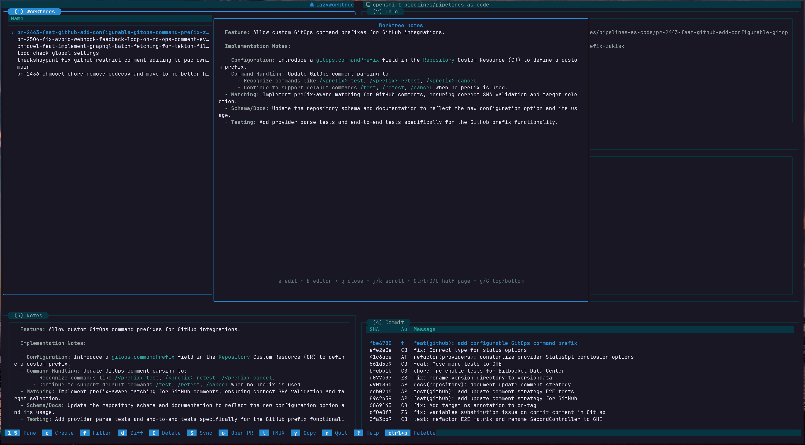
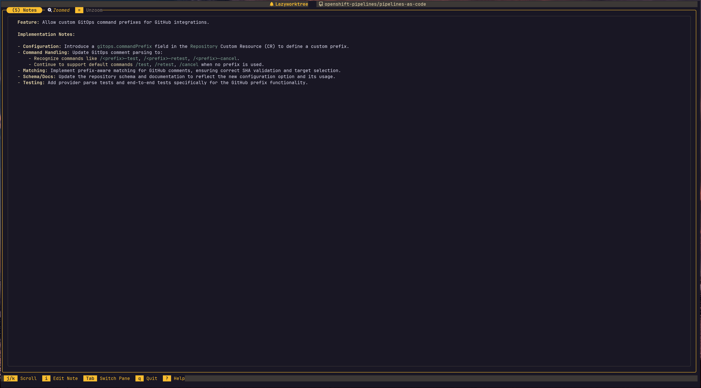

# Screenshots

Use this gallery as a visual guide to major workflows and theme appearances.
Click any image to view it enlarged.

## Workflow Views

  <figure>
    
    <figcaption>Main multi-pane interface with worktree list, status, and commit history.</figcaption>
  </figure>
  <figure>
    
    <figcaption>Taskboard view grouped by worktree (everforest-light).</figcaption>
  </figure>
  <figure>
    
    <figcaption>Command palette with keyboard filtering (nord).</figcaption>
  </figure>
  <figure>
    
    <figcaption>GitHub Actions log viewer in pager mode (rose-pine).</figcaption>
  </figure>
  <figure>
    
    <figcaption>Branch creation flow and naming suggestions (tokyo-night).</figcaption>
  </figure>
  <figure>
    
    <figcaption>Commit file tree inspection and diff navigation (kanagawa).</figcaption>
  </figure>
  <figure>
    
    <figcaption>Worktree notes authoring and context capture (solarized-dark).</figcaption>
  </figure>

## Notes and Rendering

  <figure>
    
    <figcaption>Rendered markdown notes with highlighted tags (gruvbox-dark).</figcaption>
  </figure>
  <figure>
    
    <figcaption>Light theme presentation for daylight terminal workflows (dracula-light).</figcaption>
  </figure>

